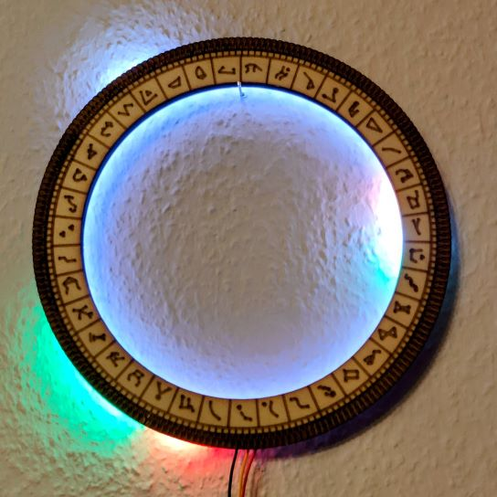

Clock and Weather Forecast with 2 big neopixel LED rings (60 and 48 px)

* main.py runs on a Raspberry Pi Pico W
  * gets the time and weather from the WLAN
  * displays time on the outer ring
  * displays current weather and temperature on the inner ring
  * the LEDs indirectly light up the wall
* 3d print files are used to assemble the rings and act as spacer to a wall
* a decorative ring can be created and put on the front to act as "clock face"

(!) Enter your own API key from openweathermap.org in main.py

